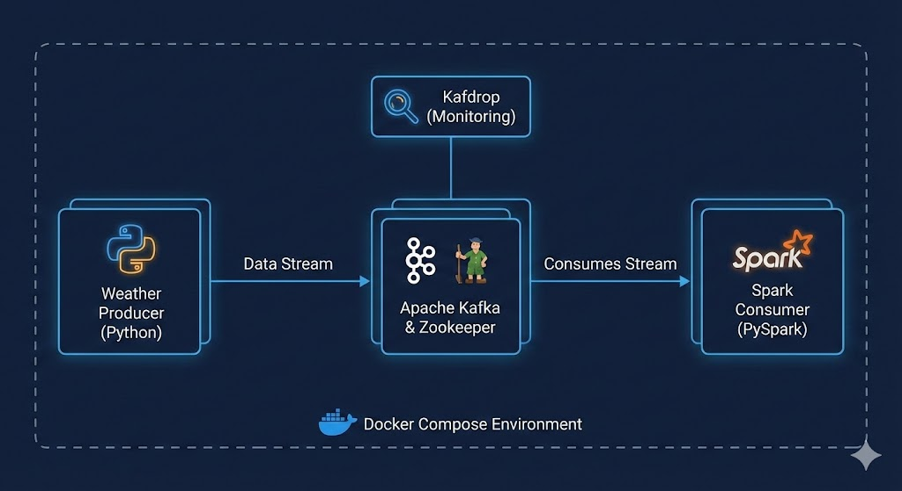

<h1 align="center">🌦️ Real-Time Weather Streaming Pipeline</h1>

<div align="center">
  
  
  
  
</div>

<br>

> A fully containerized, event-driven data pipeline utilizing Apache Kafka for high-throughput message brokering and PySpark for real-time stream processing. 

---

## 🏗️ Architecture



This project utilizes a microservices approach, entirely orchestrated via Docker Compose. 

| Service | Technology | Description |
| :--- | :--- | :--- |
| **Zookeeper** | `confluentinc/cp-zookeeper` | Manages cluster state and coordinates the Kafka broker. |
| **Message Broker** | `confluentinc/cp-kafka` | Distributed event streaming platform handling the data queue. |
| **Producer** | `python:3.9-slim` (Custom) | Generates and publishes streaming data to the Kafka topic. |
| **Consumer** | `apache/spark:3.5.1` (Custom) | Subscribes to the Kafka topic and processes the data via PySpark. |
| **Monitoring** | `kafdrop` | Web UI for visualizing topics, consumer groups, and message payloads. |

---

## 📂 Project Structure

```text
.
├── Dockerfile.producer      # Lightweight Python image for data generation
├── Dockerfile.consumer      # Spark image layered with required Python packages
├── docker-compose.yml       # Infrastructure orchestration
├── weather_producer.py      # Kafka producer script
├── spark_consumer.py        # PySpark structured streaming script
├── .gitignore               # Version control exclusions
└── README.md                # Project documentation